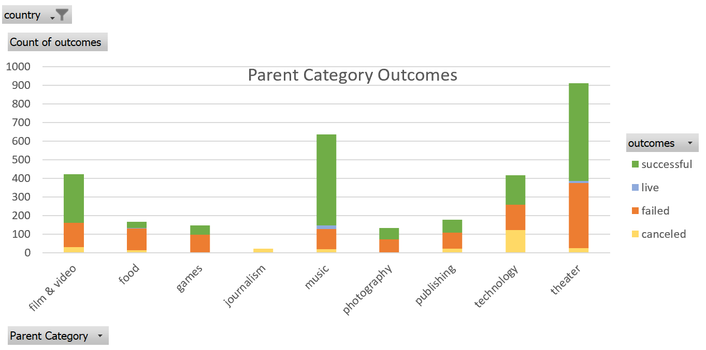
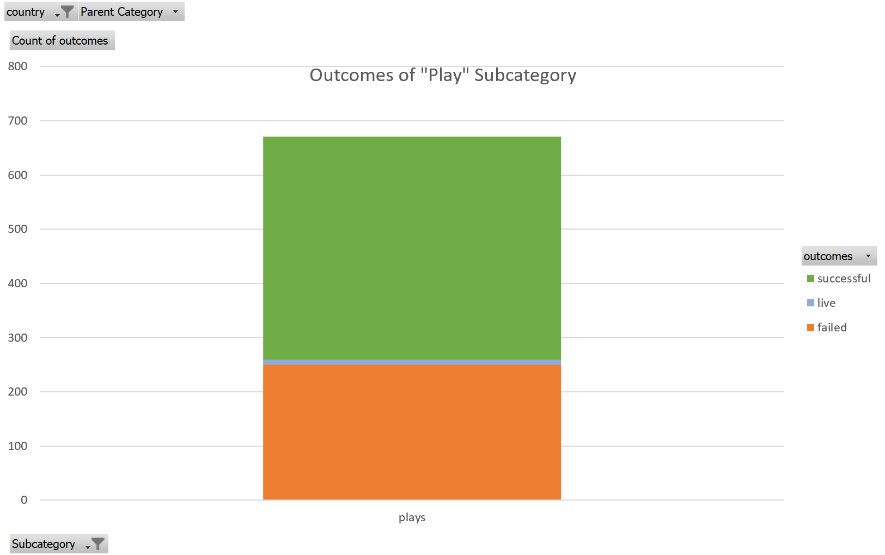
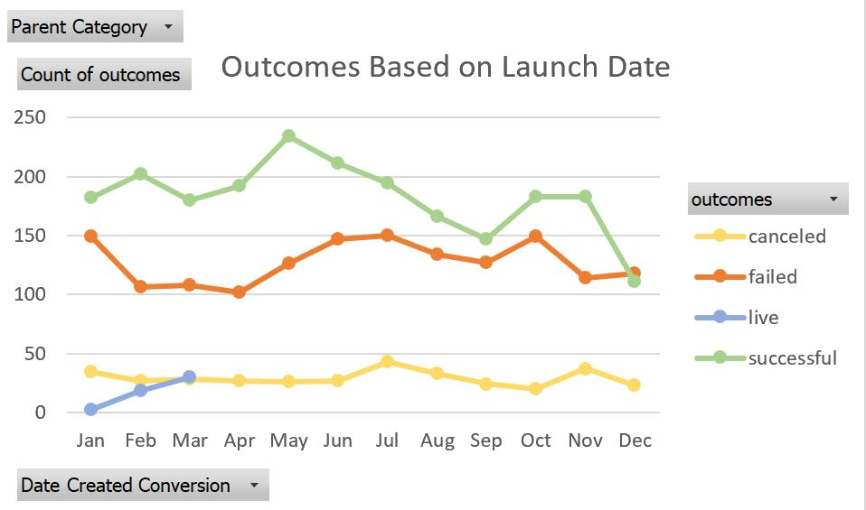
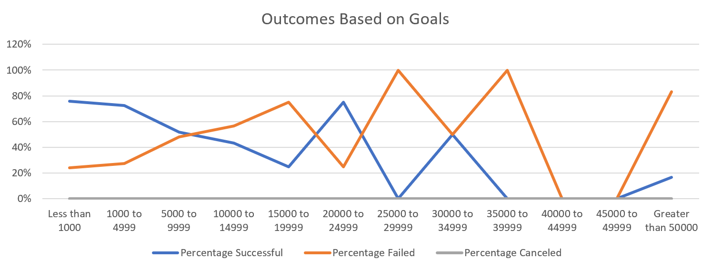
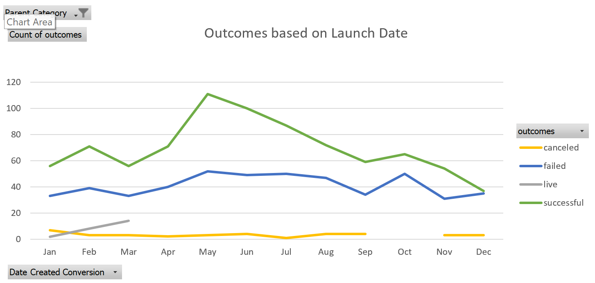

# An Analysis of Kickstarter Campaigns
Performing analysis on Kickstarter data to uncover trends that could define whether a crowdfundimg campaign is likely to achieve success or not, based on the category, campaighn launch date, set goal, etc.

## Outcomes by Category
Most campaigns are in the Theater category, followed by Music, Film & Video and Technology.

## Outcomes of "Play" Subcategory in the US
About 61% of the campaigns for funding Plays in the US are successful.

## Outcomes based on Launch Date
May and June seem to be good months to launch a campaign in the Theater category, since there is a spike in successful campaigns in those months.

## Analysis on Kickstarter data for Theater Campaigns

About 96% of campaigns for the "Plays" subcategory have goals under $25,000. For goals set under $5,000, there is a much greater chance of success, while between $15,000 and $19,999, there seems to be an equal chance of success and failure.\
For goals higher than $20,000, the success rate starts to drop considerably.\
 
For goals between $25,000 and $50,000, there are not enough data points to draw confident conclusions. When goals are higher than $50,000, however, campaigns are much more likely to fail, with a failure rate of abour 88%.\
 

Most campaigns in the Theater category are successful and there doesn't seem to be a correlation between the campaign running longer and a successful outcome. The average length of a successful campaign is lower than a failed one.\
 
The highest number of campaigns are launched in the month of May and, judging by the distance between the "Successful" and "Failed" lines in the graph, there is also a higher chance of success for campaigns that are launched on that month.\
 
During the other months of the year, both lines seem to follow similar trends, meaning the ups and downs are just proportional to the higher or lower volume of campaigns launched, without indicating a higher or lower chance of success.\

### Conclusion
It seems that campaigns in the Theater category with goals of up to $5,000, that are launched in the month of May will have the greatest chance of success.\
 
Other interesting graphs and tables would be Outcomes by length of time that the campaign ran for; Outcomes filtered for Staff Picks; Correlation between the Average Donation and the Percentage Funded.\
A possible limitation/issue with the dataset is that the goals and pledged amounts seem to be represented in different currencies.
